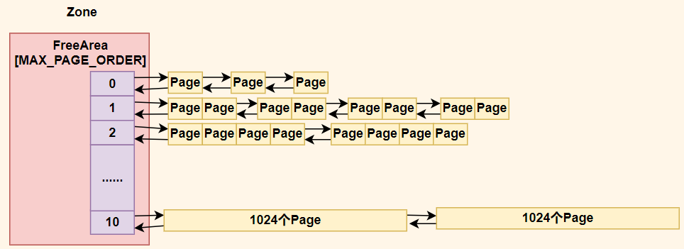
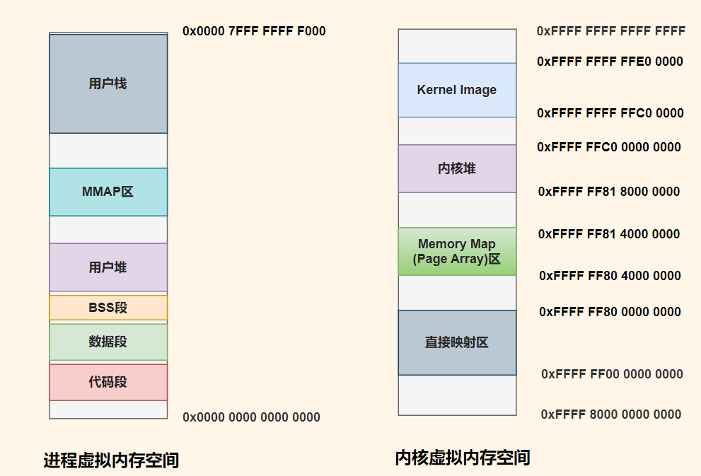

# 内存管理

## 物理内存组织
Eonix 采用 **FLATMEM 平坦内存模型**以及 **UMA 架构**，把可用于分配的物理内存统一纳入 Zone 进行管理。Zone 所管理的物理内存页会被进一步划分成不同阶数的 FreeArea。其中，每一个 FreeArea 均由大小为 2^i^ 的物理内存块所构成，这些物理块作为内存分配与管理的基础单元，在整个物理内存的组织架构中起着关键作用，用于实现高效的内存管理操作。


## 物理内存分配
物理内存分配可根据所需内存大小分为**页分配**和**字节块分配**，整个物理内存分配由**伙伴系统**和**slab分配器**合作完成。

### 页分配
Eonix 使用伙伴系统管理内存页的分配，其工作原理是将内存块按照 2 的幂次方大小分为多个层级，并通过合并和分解有效减少外部碎片。**分配物理页时**，伙伴系统从最小适合该请求的层级开始查找。通过检查和计算伙伴块的地址，可以快速地进行内存分割与合并。当需要分配的内存块小于当前可用最小块时，将当前块一分为二，直到找到合适大小的块为止。**回收物理页时**，若其伙伴块也空闲，则将两个块合并为一个更大的块，迭代进行直到不能再合并为止。伙伴分配器的优点在于分配和释放内存块的操作非常快速，且通过内存块大小的选择和合并操作，有效减少了外部碎片。

### 字节块分配
Eonix 采用 slab 分配器来实现字节块分配。slab 分配器针对不同大小的常用内存对象预先分配一系列内存块，这些内存块组织成**缓存池**。当有特定字节大小的内存块分配请求时，首先在对应的 slab 缓存池中查找空闲内存块。若找到，则直接分配；若未找到，slab 分配器依据既定策略向伙伴系统申请一定数量页面，将这些页面划分成所需大小的字节块并加入对应的 slab 缓存池，然后从中取出字节块分配。slab 分配器的优势显著，尤其在频繁申请和释放相同大小字节块的场景下，它能极大减少内存碎片的产生，大幅提升内存分配与释放效率。这对于内核中诸如进程控制块、文件描述符等众多小内存对象频繁的分配回收需求极为关键，有力保障了系统整体稳定高效运行。

## 地址空间布局
Eonix 地址空间布局借鉴了 Linux 的设计，采用**用户空间和内核空间统一布局**方式。

**Kernel Image**
Kernel Image 位于内核虚拟内存空间的最上方，其中包含了内核的可执行代码和内核数据结构，是内核运行的核心部分。
**Memory Map 区**
Memory Map 区用于存储描述物理页的数据结构 PageArray，此结构对于物理内存管理至关重要。
**直接映射区**
直接映射区将物理内存直接映射到内核虚拟地址空间，使得内核可以方便地访问物理内存。例如，物理地址加上固定的一个偏移量 PHYS_OFFSET 即可得到其在内核中的虚拟地址，

## 缺页异常处理
Eonix 能够有效利用缺页异常处理来实现**写时复制(Copy on write)**、**懒分配(Lazy page allocation)** 以及**高效用户态内存拷贝**技术。
**写时复制**
在PageFault处理中，内核会根据COW标志位该页是否进行写时复制，并根据 Page 结构体中的原子引用计数判断是否为最后一个持有者，如果不是最后一个持有者，会新分配一个页并复制原始页的数据并恢复写标志位重新映射，如果是最后一个持有者，直接恢复读写标志位。
``` rust
if attributes & PA_COW as usize != 0 {
            attributes &= !PA_COW as usize;
            if area.permission.write {
                attributes |= PA_RW as usize;
            } else {
                attributes &= !PA_RW as usize;
            }

            let page = unsafe { Page::take_pfn(pfn, 0) };
            if page.load_refcount() == 1 {
                // SAFETY: This is actually safe. If we read `1` here and we have `MMList` lock
                // held, there couldn't be neither other processes sharing the page, nor other
                // threads making the page COW at the same time.
                pte.set_attributes(attributes);
                core::mem::forget(page);
                return Ok(());
            }

            let new_page = Page::alloc_one();
            if attributes & PA_ANON as usize != 0 {
                new_page.zero();
            } else {
                new_page
                    .as_cached()
                    .as_mut_slice::<u8>(0x1000)
                    .copy_from_slice(CachedPP::new(pfn).as_slice(0x1000));
            }

            attributes &= !(PA_A | PA_ANON) as usize;

            pfn = new_page.into_pfn();
            pte.set(pfn, attributes);
        }
```

**懒分配**
懒分配技术主要用于堆栈分配以及 mmap 匿名映射或文件映射。在传统的内存分配方法中，操作系统在进程请求内存时会立即为其分配实际的物理内存。然而，这种方法在某些情况下可能导致资源的浪费，因为进程可能并不会立即使用全部分配的内存。
懒分配技术的核心思想是推迟实际物理内存的分配，直到进程真正访问到该内存区域。这样可以优化内存使用，提高系统性能。对于内存的懒分配，比如堆栈分配，mmap 匿名内存分配，Eonix 将许可分配的范围记录下来，但并不进行实际分配操作，当用户访问到许诺分配但未分配的页面时会触发缺页异常，缺页异常处理函数会进行实际的分配操作。

**高效用户态内存拷贝**
在系统调用过程中，内核需要频繁与用户态指针指向的数据进行交互，例如 read、write 系统调用。在 Eonix 中，用户和内核共享地址空间，因此在访问用户态的内存时不需要同 xv6/rcore 那样通过软件查询页表，而是可以直接解引用用户态指针。
然而，用户态指针（例如，read 系统调用参数中指向的用户态buf的指针）并不总是有效的，有可能指向非法内存，在这种情况下，仅通过类似 memcpy 简单拷贝操作可能导致内核的panic。Eonix 内核的用户态内存拷贝参考了 Linux copy_from_user 的实现思路，利用 PageFault 实现内核访问用户态内存的高效拷贝和错误处理。具体实现为当内核访问用户态指针出现 PageFault，会在 PageFault 处理函数中调用 try_page_fault_fix，此函数会修改进程中断上下文的 pc 值，使 PageFault 处理完毕后跳转到拷贝结束处，并可以根据拷贝字节数判断拷贝过程中是否出现异常状况。该处理方法在用户指针正常时速度极快，同时还能完全复用用户缺页异常处理的代码来处理用户指针懒加载/写时复制的情况。并且为了进一步方便内核使用用户态指针，Eonix 定义了 UserBuffer、UserString、UserPointer 结构体。
``` rust
/// Try to fix the page fault by jumping to the `error` address.
///
/// Panic if we can't find the `ip` in the fix list.
fn try_page_fault_fix(int_stack: &mut InterruptContext, addr: VAddr) {
    let ip = int_stack.rip as u64;

    // SAFETY: `FIX_START` and `FIX_END` are defined in the linker script in `.rodata` section.
    let entries = unsafe {
        core::slice::from_raw_parts(
            FIX_START,
            (FIX_END as usize - FIX_START as usize) / size_of::<FixEntry>(),
        )
    };

    for entry in entries.iter() {
        if ip >= entry.start && ip < entry.start + entry.length {
            int_stack.rip = entry.jump_address as u64;
            return;
        }
    }

    kernel_page_fault_die(addr, ip as usize)
}
```
